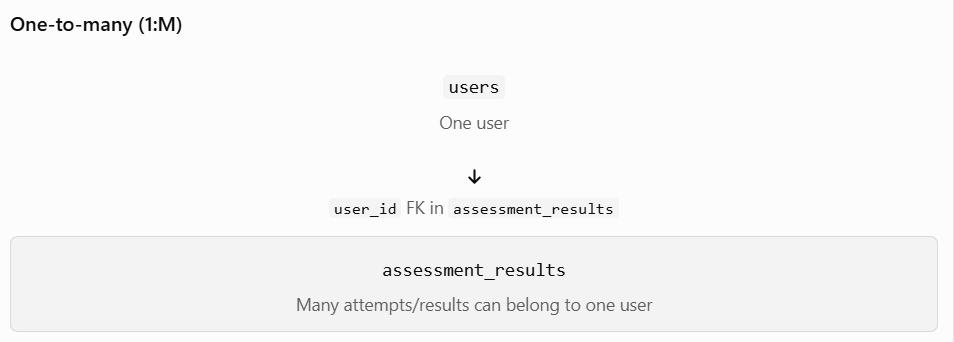
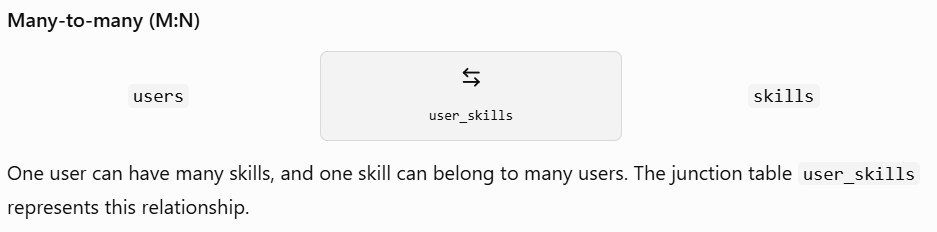
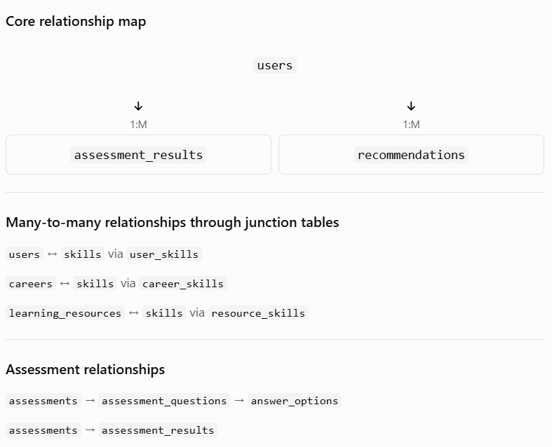

# 2.12 — Designing the Complete Database Schema
// Part1
This is a **major lesson** because we're now going to combine what you've learned:

```text
Entities
   ↓
Attributes
   ↓
Primary Keys
   ↓
Foreign Keys
   ↓
Relationships
   ↓
Normalization
   ↓
Complete Database Schema
```

Our goal is to design the database for the **AI Skill & Career Management Platform** before we implement it in PostgreSQL.

### What we'll do in 2.12

We'll go through this step-by-step:

1. Identify our final tables
2. Define columns for each table
3. Choose primary keys
4. Choose foreign keys
5. Apply relationships
6. Handle many-to-many relationships
7. Check normalization
8. Review the complete schema
9. Produce the **final PostgreSQL database design**

For example, we'll eventually reach something conceptually like:

```text
users
skills
careers
assessments
assessment_results
learning_resources
recommendations
user_skills
...
```

But **don't assume this is our final table list yet**. We'll derive it carefully from the project's requirements.

---

//Part 2
# 2.12 Part 2 — Primary Keys, Foreign Keys & Relationships

Now we'll take our candidate tables and determine:

1. **Primary Key (PK)**
2. **Foreign Key (FK)**
3. **Relationships**
4. **How tables connect**

Our current candidate structure is:

```text
users
skills
careers
assessments
assessment_results
learning_resources
recommendations
user_skills
```

## 1. Primary Keys

Every main table needs a way to uniquely identify its records.

For example:

```text
users
----------------
user_id PK

skills
----------------
skill_id PK

careers
----------------
career_id PK

assessments
----------------
assessment_id PK
```

And similarly:

```text
assessment_results
------------------
result_id PK

learning_resources
------------------
resource_id PK

recommendations
---------------
recommendation_id PK
```

For `user_skills`, we have two common designs.

### Option A — Composite Primary Key

```text
user_skills
------------------------
user_id PK, FK
skill_id PK, FK
```

Together:

```text
(user_id, skill_id)
```

uniquely identifies the relationship.

### Option B — Separate ID

```text
user_skills
------------------------
user_skill_id PK
user_id FK
skill_id FK
```

We'll decide which approach fits our project best during the final schema review.

---

# 2. Foreign Keys

Now let's connect our tables.

### User → Assessment Result

```text
users
  │
  │ 1:M
  ▼
assessment_results
```

So:

```text
assessment_results.user_id
```

can reference:

```text
users.user_id
```

---

### Assessment → Assessment Result

```text
assessments
     │
     │ 1:M
     ▼
assessment_results
```

Therefore:

```text
assessment_results.assessment_id
```

references:

```text
assessments.assessment_id
```

This is important because a result needs to tell us:

> **Which user took which assessment and what was their score?**

Conceptually:

```text
assessment_results
------------------------------------------------
result_id | user_id | assessment_id | score
```

---

# 3. User ↔ Skill

We already established:

```text
User ↔ Skill = M:N
```

Therefore:

```text
users
   │
   │ 1:M
   ▼
user_skills
   ▲
   │ 1:M
   │
skills
```

Example:

```text
user_skills

user_id | skill_id
--------|---------
1       | 1
1       | 2
1       | 3
2       | 1
```

This means:

```text
User 1 → Skills 1, 2, 3
User 2 → Skill 1
```

---

# 4. Important Schema Design Question

Now we need to be careful with **recommendations**.

Earlier we used:

```text
assessment_result → recommendation
```

But our project requirement is broader.

A recommendation could be generated based on:

- user's skills
- skill gaps
- career goal
- assessment results
- AI analysis

Therefore, we shouldn't blindly make:

```text
assessment_result_id → recommendation
```

the only connection.

This is exactly why **database schema design requires analyzing the actual project requirements**, not simply converting every sentence into a foreign key.

We'll design this carefully in the next parts.

---

//Part 3
# 2.12 Part 3 — Designing the Remaining Tables and Their Attributes

Now we will decide what information each table should store.

Remember:

- Table = the type of information being stored.
- Column/attribute = a particular piece of information.
- Primary key (PK) = uniquely identifies a record.
- Foreign key (FK) = connects a record to another table.

## Step 1: Review our candidate tables

We currently have eight candidate tables:

| Table                | Purpose                                  |
| -------------------- | ---------------------------------------- |
| `users`              | User account and profile information     |
| `skills`             | Skills offered by the platform           |
| `careers`            | Career paths and descriptions            |
| `assessments`        | Assessments users can take               |
| `assessment_results` | Users' assessment attempts and scores    |
| `learning_resources` | Learning materials and links             |
| `recommendations`    | Personalized career or learning guidance |
| `user_skills`        | Connects users and skills                |

We'll refine the attributes before considering this schema final.

## Step 2: Design the remaining tables

### A. `careers`

Stores career information.

| Column               | Purpose            |
| -------------------- | ------------------ |
| `career_id` (PK)     | Unique career ID   |
| `career_name`        | Name of the career |
| `career_description` | Career description |

Example: Software Developer, Data Scientist, AI Engineer.

### B. `learning_resources`

Stores learning materials.

| Column             | Purpose                   |
| ------------------ | ------------------------- |
| `resource_id` (PK) | Unique resource ID        |
| `title`            | Resource title            |
| `description`      | What the resource teaches |
| `url`              | Link to the resource      |

Later, we'll determine how resources connect to skills and careers. A resource may be useful for multiple skills, so we shouldn't assume a simple 1:M relationship without checking the requirements.

### C. `recommendations`

Stores personalized recommendations.

| Column                   | Purpose                                   |
| ------------------------ | ----------------------------------------- |
| `recommendation_id` (PK) | Unique recommendation ID                  |
| `user_id` (FK)           | User receiving the recommendation         |
| `recommendation_type`    | Career, skill, or learning recommendation |
| `content`                | Recommendation details                    |
| `created_at`             | When it was generated                     |

For now, `user_id` represents the user receiving the recommendation. We can add other foreign keys if our finalized requirements need them.

### D. `user_skills`

Connects users and skills through the M:N relationship.

| Column              | Purpose                      |
| ------------------- | ---------------------------- |
| `user_id` (PK, FK)  | References `users.user_id`   |
| `skill_id` (PK, FK) | References `skills.skill_id` |

Together, `(user_id, skill_id)` form a composite primary key. This prevents the same user-skill pair from being entered twice.

For example:

```
user_id | skill_id
--------|---------
1       | 1
1       | 2
2       | 1
```

User 1 has skills 1 and 2; User 2 has skill 1.

## Step 3: Important design decision

Our project may eventually need a separate table to map careers to required skills, such as `career_skills`, because one career can require multiple skills and one skill can support multiple careers.

We'll evaluate that relationship rather than adding tables without a clear requirement.

// Part 4


# Module 2 — Lesson 2.12, Part 4: Review the Complete Database Schema

In this lesson, we'll combine everything we've learned so far and review the database structure for our AI Skill & Career Management Platform.

Goal: By the end, you'll be able to explain each table, its columns, its primary key (PK), its foreign keys (FKs), and how the tables connect.

## 1. Review our proposed tables

We'll start with these nine candidate tables. The schema is still a proposal; we'll validate and finalize it in Part 5.

1\. `users`

Stores user account and profile information.

Columns: `user_id` (PK), `user_name`, `phone_no`

2\. `skills`

Stores skills available on the platform.

Columns: `skill_id` (PK), `skill_name`, `skill_description`

3\. `careers`

Stores career paths and descriptions.

Columns: `career_id` (PK), `career_name`, `career_description`

4\. `assessments`

Stores assessments that users can take.

Columns: `assessment_id` (PK), `title`, `description`

5\. `assessment_results`

Records a user's assessment attempt and score.

Columns: `result_id` (PK), `user_id` (FK), `assessment_id` (FK), `score`, `completed_at`

6\. `learning_resources`

Stores learning materials and links.

Columns: `resource_id` (PK), `title`, `description`, `url`

7\. `recommendations`

Stores personalized guidance generated for a user.

Columns: `recommendation_id` (PK), `user_id` (FK), `recommendation_type`, `content`, `created_at`

8\. `user_skills`

Connects users to the skills they have or are learning.

Columns: `user_id` (PK, FK), `skill_id` (PK, FK), `proficiency_level`

9\. `career_skills`

Connects careers to the skills required for them.

Proposed columns: `career_id` (PK, FK), `skill_id` (PK, FK), `required_level`

These columns are a starting point, not a complete production schema. For example, authentication will require additional user fields, and a real assessment system will eventually need questions and answer options.

## 2. Understand the main relationships



The same principle applies to `assessments` and `assessment_results`: one assessment can have many result records, while each result references one assessment.



Similarly, `career_skills` connects `careers` and `skills`. Its `required_level` can describe the proficiency level expected for a career.

## 3. Check the design before finalizing it

A few decisions remain:

- User accounts: Add suitable fields such as `email`, `password_hash`, and `created_at`. Passwords must never be stored as plain text.
- Learning resources: We need to decide how resources connect to skills or careers. A junction table may be appropriate if one resource supports multiple skills.
- Assessments: If users take actual quizzes, we will likely need `assessment_questions` and possibly `answer_options` tables.
- Recommendations: We should decide whether recommendations store text only or also reference a career, skill, or learning resource.


// Part 5
# Module 2 — Lesson 2.12, Part 5: Normalization Check & Final Database Schema

Welcome to the final part of Lesson 2.12! 🎯

In this lesson, we'll review our database design for the AI Skill & Career Management Platform, check normalization, and prepare a schema that we can implement later in PostgreSQL and Spring Boot.

Learning goals:

- Check for duplicate and poorly organized data.
- Finalize candidate tables and their columns.
- Identify primary keys (PKs) and foreign keys (FKs).
- Understand how the tables relate to one another.

## 1. Review the database normalization rules

| Normal form | Rule                                                                   | Project example                                                                         |
| ----------- | ---------------------------------------------------------------------- | --------------------------------------------------------------------------------------- |
| 1NF         | Each column stores one value per row.                                  | Store one skill per `user_skills` row instead of `"Java, SQL, React"` in one column.    |
| 2NF         | Every non-key attribute depends on the entire primary key.             | In `user_skills`, `proficiency_level` depends on the particular user-skill pair.        |
| 3NF         | Non-key attributes depend on the key, not on other non-key attributes. | Store a career's description in `careers`, not repeatedly in every user recommendation. |

Our junction tables are particularly useful for meeting these rules.

## 2. Proposed final database schema

We'll use the following as our working schema. It is designed around our current requirements; we'll refine details as we implement authentication, assessments, and recommendations.

1\. `users`

- `user_id` — PK
- `user_name`
- `email` — unique
- `phone_no`
- `password_hash`
- `created_at`

2\. `skills`

- `skill_id` — PK
- `skill_name`
- `skill_description`

3\. `careers`

- `career_id` — PK
- `career_name`
- `career_description`

4\. `assessments`

- `assessment_id` — PK
- `title`
- `description`

5\. `assessment_results`

- `result_id` — PK
- `user_id` — FK → `users.user_id`
- `assessment_id` — FK → `assessments.assessment_id`
- `score`
- `completed_at`

6\. `learning_resources`

- `resource_id` — PK
- `title`
- `description`
- `url`

7\. `recommendations`

- `recommendation_id` — PK
- `user_id` — FK → `users.user_id`
- `recommendation_type`
- `content`
- `created_at`

8\. `user_skills`

- `user_id` — PK, FK → `users.user_id`
- `skill_id` — PK, FK → `skills.skill_id`
- `proficiency_level`

Composite PK: (`user_id`, `skill_id`)

9\. `career_skills`

- `career_id` — PK, FK → `careers.career_id`
- `skill_id` — PK, FK → `skills.skill_id`
- `required_level`

Composite PK: (`career_id`, `skill_id`)

10\. `resource_skills`

- `resource_id` — PK, FK → `learning_resources.resource_id`
- `skill_id` — PK, FK → `skills.skill_id`

Composite PK: (`resource_id`, `skill_id`)

11\. `assessment_questions`

- `question_id` — PK
- `assessment_id` — FK → `assessments.assessment_id`
- `question_text`

12\. `answer_options`

- `option_id` — PK
- `question_id` — FK → `assessment_questions.question_id`
- `option_text`
- `is_correct`

### Important notes

- `password_hash` stores a secure password hash, never the original password.
- The `email` uniqueness constraint helps prevent duplicate accounts.
- `user_skills`, `career_skills`, and `resource_skills` each use a composite primary key to prevent duplicate pairs.
- We may need additional tables later, such as `assessment_attempt_answers`, to record which answers a student selected for individual questions. That would support detailed feedback and more meaningful analytics.
- Recommendations may eventually use explicit references to careers, skills, or resources rather than storing everything only in `content`.

## 3. Understand the relationships



Remember: the `1:M` relationship is implemented by putting the foreign key on the many side. For example, `assessment_results.assessment_id` references the assessment being attempted.


