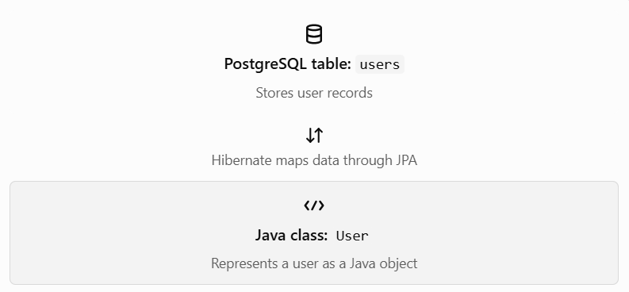

# Module 2 — Lesson 2.13: Mapping Database Tables to Spring Boot JPA Entities


## 1. What is JPA Entity Mapping?

Remember our database table `users` from Lesson 2.12?

| user_id | user_name | email             |
| ------- | --------- | ----------------- |
| 1       | Ram       | ram\@example.com  |
| 2       | Sita      | sita\@example.com |

In PostgreSQL, this information is stored in a table. In Spring Boot, we can represent each row as a Java object.



Simple definition: JPA entity mapping connects a Java class to a database table and its fields to the table's columns.

Understand these three terms:

| Term      | Meaning                                                                              |
| --------- | ------------------------------------------------------------------------------------ |
| JPA       | Java standard for mapping and working with relational database data through objects. |
| Hibernate | A popular implementation of JPA that performs the object-relational mapping.         |
| Entity    | A Java class whose objects are mapped to database records.                           |

## 2. Our first entity: `User`

Let's create a Java class representing the `users` table.

```
package com.example.aiskill.entity;

import jakarta.persistence.Entity;
import jakarta.persistence.Id;
import jakarta.persistence.GeneratedValue;
import jakarta.persistence.GenerationType;
import jakarta.persistence.Table;

@Entity
@Table(name = "users")
public class User {

    @Id
    @GeneratedValue(strategy = GenerationType.IDENTITY)
    private Long userId;

    private String userName;
    private String email;

    public User() {
    }

    public Long getUserId() {
        return userId;
    }

    public void setUserId(Long userId) {
        this.userId = userId;
    }

    public String getUserName() {
        return userName;
    }

    public void setUserName(String userName) {
        this.userName = userName;
    }

    public String getEmail() {
        return email;
    }

    public void setEmail(String email) {
        this.email = email;
    }
}
```

For this first lesson, focus on understanding the annotations rather than memorizing the code.

Important: This example uses Spring Boot 3 or later conventions with `jakarta.persistence` imports. If your project uses Spring Boot 4, its JPA setup may differ by dependency configuration, but the core entity concepts remain the same.

## 3. Understand the annotations

### `@Entity`

Marks the Java class as a JPA entity that Hibernate can map to a database table.

```
@Entity
public class User {
}
```

### `@Table(name = "users")`

Specifies the database table name explicitly.

```
@Table(name = "users")
```

Without this annotation, JPA uses its naming conventions to determine the table name.

### `@Id`

Identifies the primary key field.

```
@Id
private Long userId;
```

### `@GeneratedValue`

Configures how the primary key is generated.

```
@GeneratedValue(strategy = GenerationType.IDENTITY)
```

`IDENTITY` commonly uses a database-generated identity value, such as a PostgreSQL identity column.

## 4. How do Java fields map to database columns?

By default, JPA maps fields to columns using its naming conventions and your project's configuration.

| Java field | Likely database column |
| ---------- | ---------------------- |
| `userId`   | `user_id`              |
| `userName` | `user_name`            |
| `email`    | `email`                |

The mapping from `userName` to `user_name` depends on the configured naming strategy. You can specify a column explicitly when needed:

```
@Column(name = "user_name")
private String userName;
```

To use `@Column`, add this import:

```
import jakarta.persistence.Column;
```

## 5. Why do we need JPA entities in our project?

Imagine a student registers on our AI Skill & Career Management Platform.

1. React sends the registration data to Spring Boot.
2. Spring Boot validates the data.
3. The backend creates a `User` Java object.
4. Hibernate persists the object to PostgreSQL through JPA.
5. The backend returns a response to React.

This makes it easier to work with database records as Java objects instead of writing raw SQL for every operation.


//Part 2
## Part 2: Mapping Fields and Columns

### 1. What is column mapping?

In our project, PostgreSQL stores data in tables, while Spring Boot works with Java objects.

Column mapping tells JPA how a Java field corresponds to a column in a database table.

For example:

Java entity — Spring Boot

`userName`

JPA / Hibernate mapping

PostgreSQL table — `users`

`user_name`

Both names can represent the same piece of information. The Java field uses camelCase, while the database column uses snake_case.

## 2. Understanding `@Column`

The `@Column` annotation lets us configure a database column from our Java entity.

Example:

```
@Column(name = "user_name", nullable = false)
private String userName;
```

Here's what each part means:

| Code                      | Meaning                                     |
| ------------------------- | ------------------------------------------- |
| `@Column`                 | Configures the column mapping               |
| `name = "user_name"`      | Specifies the PostgreSQL column name        |
| `nullable = false`        | The database column must not contain `NULL` |
| `private String userName` | Declares a Java field for the user's name   |

Important: `@Column` does not mean that you must manually write an SQL column. Depending on your JPA/Hibernate schema-generation configuration, Hibernate can use the mapping to create or update the database schema. In production, database migrations are generally safer than automatic schema updates.

## 3. Other important column options

| Option     | Example              | Purpose                                              |
| ---------- | -------------------- | ---------------------------------------------------- |
| `name`     | `name = "user_name"` | Specifies the database column name                   |
| `nullable` | `nullable = false`   | Disallows `NULL` values                              |
| `unique`   | `unique = true`      | Requests a uniqueness constraint                     |
| `length`   | `length = 100`       | Sets the column length for applicable string columns |

For example, our platform should not allow two accounts to use the same email address.

```
@Column(name = "email", nullable = false, unique = true)
private String email;
```

This expresses three requirements:

- The database column is called `email`.
- An email value is required.
- Duplicate email values are prohibited by the uniqueness constraint.

For reliable production behavior, ensure these constraints actually exist in the database, including when using migrations.

## 4. Let's build our `User` entity

Here is a beginner-friendly example based on our proposed database schema.

File structure

```
backend/
└── src/
    └── main/
        └── java/
            └── com/example/aiskill/
                └── entity/
                    └── User.java
```

`User.java`

```
package com.example.aiskill.entity;

import jakarta.persistence.*;
import java.time.LocalDateTime;

@Entity
@Table(name = "users")
public class User {

    @Id
    @GeneratedValue(strategy = GenerationType.IDENTITY)
    @Column(name = "user_id")
    private Long userId;

    @Column(name = "user_name", nullable = false, length = 100)
    private String userName;

    @Column(name = "email", nullable = false, unique = true)
    private String email;

    @Column(name = "phone_no", length = 20)
    private String phoneNo;

    @Column(name = "password_hash", nullable = false)
    private String passwordHash;

    @Column(name = "created_at", nullable = false)
    private LocalDateTime createdAt;

    public User() {
    }

    // Getters and setters can be generated by your IDE.
}
```

This example illustrates the column mappings from our proposed schema. The `createdAt` field would also need to be initialized by your application or another configured mechanism before inserting a user, since the column is non-nullable.

We will study generated IDs in Part 3, so you don't need to master that annotation yet.

## 5. Java types versus PostgreSQL types

JPA maps Java types to suitable database types.

| Java type       | Typical PostgreSQL type | Example                |
| --------------- | ----------------------- | ---------------------- |
| `Long`          | `BIGINT`                | User ID                |
| `String`        | `VARCHAR` or `TEXT`     | User name              |
| `Integer`       | `INTEGER`               | A whole-number value   |
| `Boolean`       | `BOOLEAN`               | `isCorrect`            |
| `LocalDateTime` | `TIMESTAMP`             | `createdAt`            |
| `BigDecimal`    | `NUMERIC` / `DECIMAL`   | Precise decimal values |

The exact SQL type depends on your database schema and JPA provider configuration. For example, a Java `String` does not always have to map to `VARCHAR`; it can also map to `TEXT`.

## 6. Database constraints versus application validation

These are related, but they solve different problems.

### Database constraint

The database enforces a rule even if an insert comes from a different application or SQL client.

Example: `email` must be unique.

### Application validation

Spring Boot checks incoming data before attempting to save it.

Example: rejecting an empty email field and returning a useful error message to React.

For example, `@Column(nullable = false)` is a database mapping constraint. By itself, it does not provide complete request validation.

Later, we can use Bean Validation annotations such as:

```
@NotBlank
@Email
private String email;
```

These annotations validate application data when validation is triggered, usually on a request DTO using `@Valid`. The database uniqueness constraint is still necessary because `@Email` does not prevent duplicate emails.
